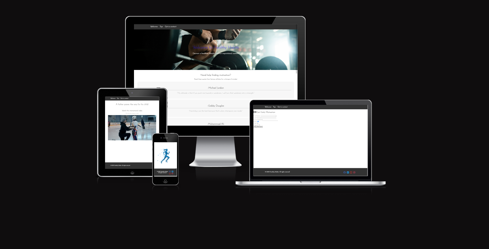
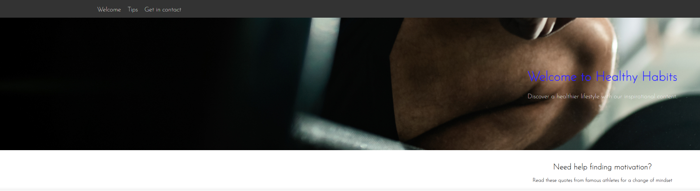
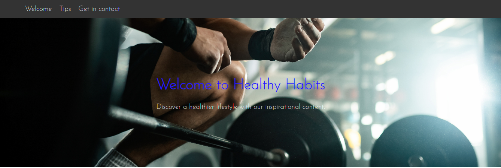
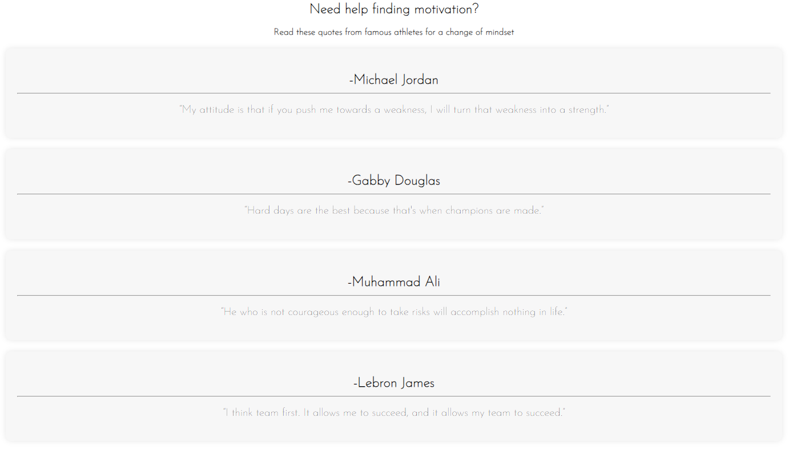
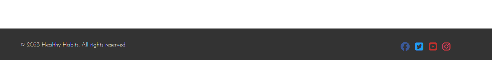
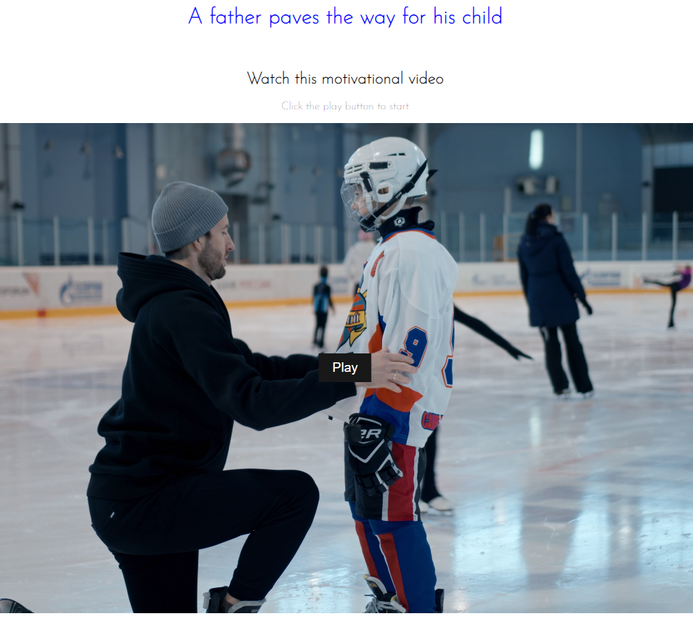
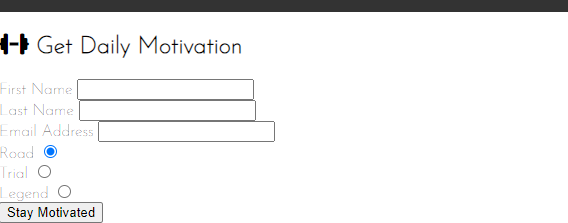
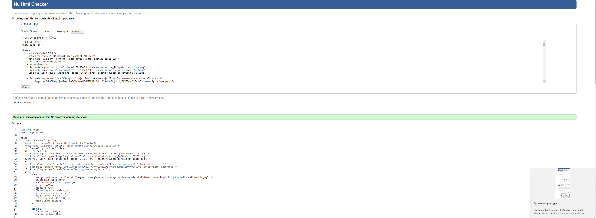
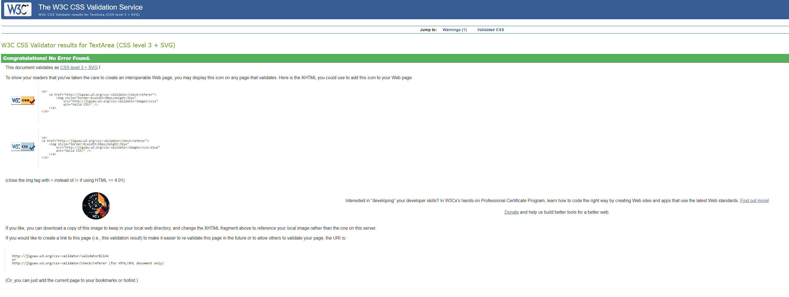
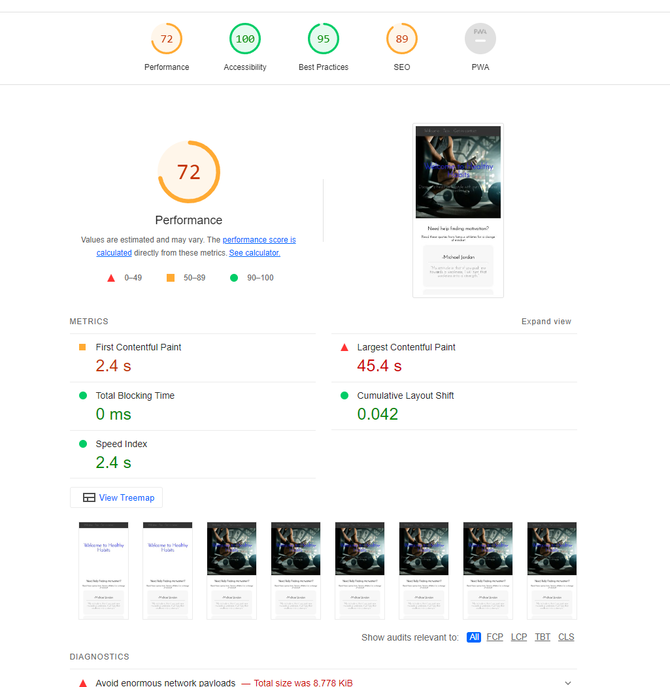

# Healthy Habits

## Project Overview

Welcome to Healthy Habits, a website dedicated to promoting fitness and healthy lifestyle habits. This project aims to inspire and guide users on their journey to a healthier life. Whether you're looking for fitness tips, motivational quotes, or information on building healthy habits, Healthy Habits has you covered. Provide us with your personal information through our form, to get updated weekly with new motivational content. 

## UX Design elements
1. User-Centric Design:
This design revolves around the needs and preferences of the users. Navigating through the website is intuitive, ensuring a seamless and enjoyable experience for visitors seeking information on fitness and healthy habits.
2. Responsive and Accessible:
The site is designed to be responsive across various devices, ensuring accessibility for users on desktops, tablets, and smartphones. This approach guarantees a consistent and user-friendly interface regardless of the device being used.
3. Clear and Engaging Content:
Emphasis is placed on presenting clear and engaging content throughout the website. From motivational quotes to informational articles, the content aims to captivate and inspire users on their journey towards a healthier lifestyle.
4. Interactive Features:
Interactive elements, such as the responsive navigation bar and video content, are incorporated to enhance user engagement. These features contribute to a more immersive experience, making the website not only informative but also enjoyable to explore.
5. Aesthetically Pleasing Design:
Visual appeal is a crucial aspect of the design, with attention given to color schemes, typography, and imagery. The aesthetic elements are thoughtfully chosen to create a visually pleasing environment that complements the overall user experience.

## Am i Responsive

## Deployed Website

[Healthy Habits Website](https://linusmolin98.github.io/Healthy-Habits/index.html)

## Table of Contents

- [Healthy Habits](#healthy-habits)
  - [Project Overview](#project-overview)
  - [UX Design elements](#ux-design-elements)
  - [Am i Responsive](#am-i-responsive)
  - [Deployed Website](#deployed-website)
  - [Table of Contents](#table-of-contents)
  - [Features](#features)
    - [Navigation](#navigation)
    - [Hero Image](#hero-image)
    - [Fitness Section](#fitness-section)
    - [Footer](#footer)
    - [Tips page](#tips-page)
    - [Sign Up](#sign-up)
  - [Features Left to Implement](#features-left-to-implement)
  - [Testing](#testing)
    - [Browser and Screen Size Testing](#browser-and-screen-size-testing)
    - [Validator Testing](#validator-testing)
    - [Unfixed Bugs](#unfixed-bugs)
    - [Lighthouse testing](#lighthouse-testing)
  - [Deployment](#deployment)
  - [Credits](#credits)
    - [Content](#content)
    - [Media](#media)
    - [External Resources](#external-resources)

## Features

### Navigation

The responsive navigation bar ensures easy navigation, allowing users to explore the three different sections of the website seamlessly. The three different links are named "Welcome", "Tips" and "Get in Contact". The links ensures user friendlines.

### Hero Image

The hero section features an inspiring image with inline CSS styling, setting the tone for the Healthy Habits experience. This is also the landing page picture that you will see at first glance of the website.

### Fitness Section

Discover motivational quotes from famous athletes, presented in a clean and engaging format. The benefits of physical and mental well-being are highlighted. 

### Footer

Connect with Healthy Habits on social media through the footer, providing easy access to stay updated on health and fitness content.

### Tips page 

Enjoy a inspirational video of a father providing his son with healthy tips. This part provides users with a visual representation of the website's content.

### Sign Up

Interested users can sign up to kickstart their fitness journey, specifying preferences and providing necessary contact details.

## Features Left to Implement

- **Additional Feature Idea:** I would like to increase the page content, get more pictures into the tips page and tidy up the get in contact page. Healthy Habits would get a positive lift if the sign_up page had a picture.

## Testing

### Browser and Screen Size Testing
The website has been tested on various browsers (Chrome, Firefox, Safari) and screen sizes to ensure a consistent and responsive user experience. The site performed well across different devices thanks to the media queries incorporated in the CSS file.
The links in the navbar works fine, it could be optimized through using a hamburger icon. Social media links works without errors.

### Validator Testing

- **HTML:** No errors found when passing through the official W3C validator.

- **CSS:** No errors found when passing through the official validator.

### Unfixed Bugs

1. Slow Loading of Images:
Some users may experience longer loading times for certain images in the gallery section. Im actively exploring optimizations to enhance image loading speed and provide a seamless browsing experience.

2. Video Loading Speed:
The video content on the site may exhibit slower loading times for some users. Im investigating ways to improve the loading speed, ensuring that all users can easily access and enjoy the video content without delays.

### Lighthouse testing 

## Deployment

The website is hosted on GitHub Pages. To deploy:
1. Navigate to the Settings tab in the GitHub repository.
2. Choose the Master Branch as the source.
3. Access the live link [here](https://linusmolin98.github.io/Healthy-Habits/index.html).

## Credits

### Content

- Favicon structure and content inspired by the Love Running project.
- Fitness quotes and content inspired by various sources, credited in the code comments.

### Media

- Hero image sourced from Unsplash.
- Additional images from [Unsplash - Fitness](https://unsplash.com/s/photos/fitness).

### External Resources

- Font Awesome kit used for social media icons.
- CSS and coding references from Stack Overflow, YouTube, and Code Institute modules.
